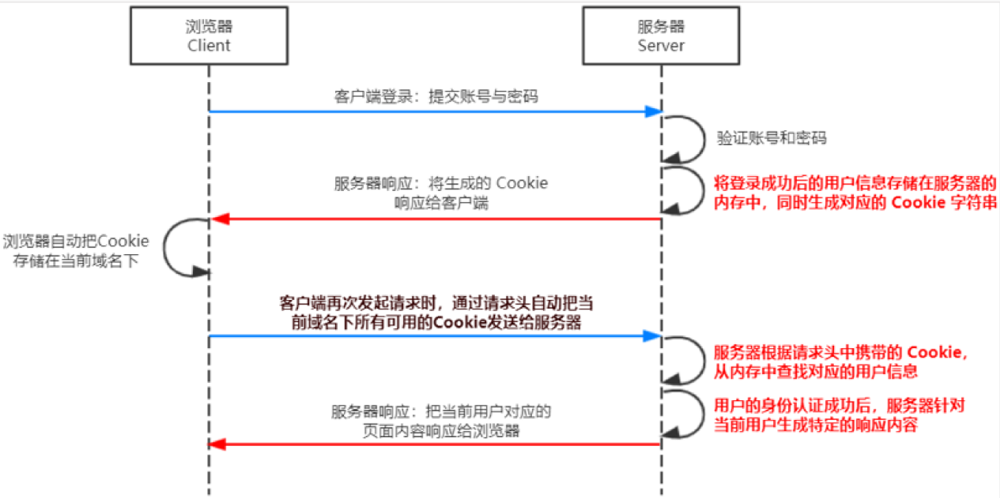
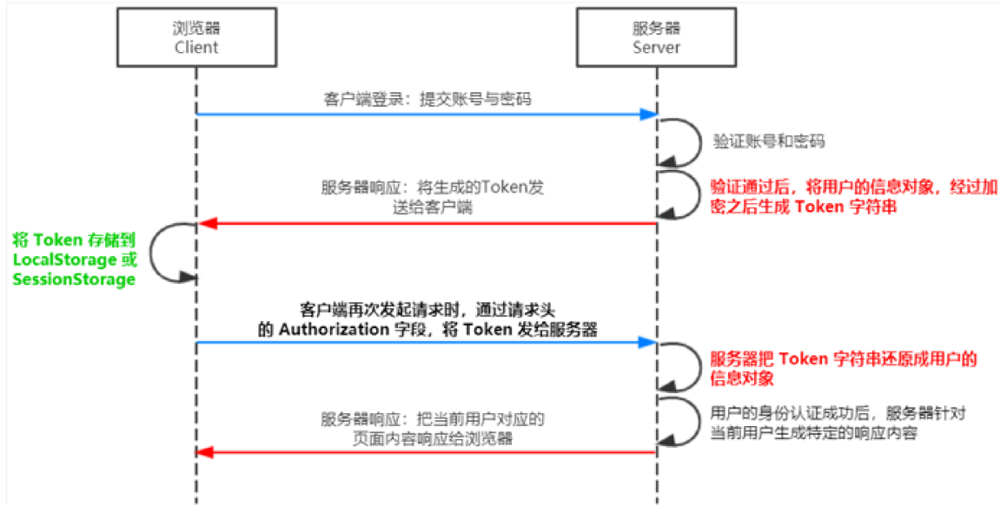
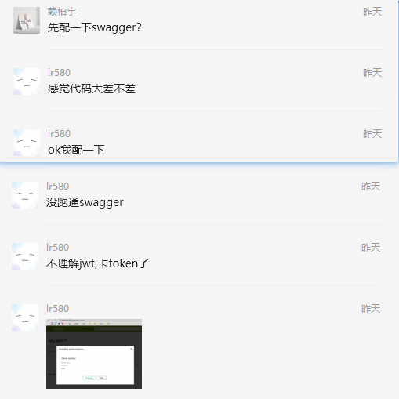
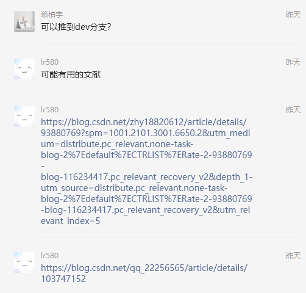
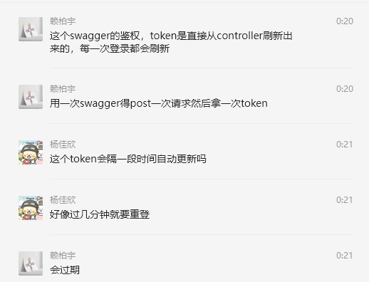

[toc]

# 项目过程管理

## 问题清单

根据可行性分析，我们收集到可能难以解决的问题有：

1. 在前后端分离的前提下，用户登录态和权限(认证和授权)的实现麻烦。
2. 接口庞多，如何快速无误地批量生成众多接口的文档说明，并能随着代码变动而自动变动。
3. 一些 bugs 的发现和解决过程。

鉴于篇幅，我们只以其中一些问题为例，展示试做、测试、修改及沟通表达等完整过程，对其他的一些问题，我们只给出扼要的总结。(因为交流量太多，下面谨以 `自动生成接口文档` 一节为例提供了关键部分的交流过程截图)

## 具体问题解决

### 用户认证和授权

在服务器渲染的开发模式里，一般使用Session 认证机制，具体而言，session 是存在服务端的，且通常每次关闭服务器就消失；cookie 是存在客户端的。session 需要配合 cookie，即客户端用 cookie 存 session 的值。cookie 不支持跨域访问，而前后端分离是跨域的，所以涉及跨域时不能用 session。如图所示：

在前后端分离的开发模式里，我们考虑了 Spring Security + JWT 的方案。JWT，即 Json web token。适合处理跨域+身份认证。工作流程如下：

 JWT 的组成：头部、有效载荷、签名(通常都是加密字符串)，以 `.` 分隔，即 `Header.Payload.Signature`。载荷是真正要传送的内容。加密是为了保证客户端无法伪造。

经过充分的讨论和对比，我们最终使用了 JWT 实现鉴权。只有使用正确的未过期的 Token 发起请求，服务器才会正确响应。提高了安全性。

### 自动生成接口文档

一个项目通常在开发和运维时会不断迭代版本，从而使得后端提供的接口发生增删改，从而相应的文档也要做出变化，例如对接口名、参数、返回值的描述。要保持与代码一致，需要很大工作量。这无疑是苦恼的。

然而，我们了解到对 Spring 项目，有 Swagger 用于描述、生成、测试和文档化 RESTful 风格的 Web 服务的工具。具体而言，Springfox Swagger 可以自动扫描 Spring 应用程序中的所有接口，并生成 Swagger 规范的文档。这样，开发人员就可以使用 Swagger UI 工具来浏览和测试这些接口。

为了验证 Swagger 的作用，在可行性分析之时，我们做了一个简单 SpringBoot hello world 项目并用 Swagger 来生成所有接口的描述。验证了其可行性。

然而，在实际项目部署时，我们遇到了新的问题。即，在使用 JWT 进行认证的情况下，我们只能通过前端访问后端接口，并不能直接调用 Swagger 默认暴露的接口。

> 交流讨论过程：
>
> 
>
> 
>
> 
>
> 

之后我们多人进行了反复尝试，查阅了大量文献，终于解决了该问题。概要的解决问题及过程如下：

1. 因 SpringBoot 版本过高，需要手动添加新的配置项以兼容 Swagger
2. 修改拦截请求的配置类，手动添加 Swagger 的相关接口 URL
3. 大幅修改 Swagger 配置类，使其暴露的接口能够被访问
4. 从数据库后台获取 JWT token，凭此进入接口导出的页面

### bugs 修复

因为遇到的 bugs 很多，大部分都能独立解决。这里只给出一小部分无法独立解决，通过交流讨论后得到解决的一小部分典型的 bugs 的发现、解决的过程。

